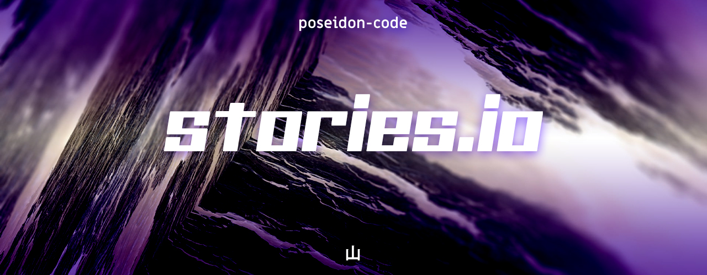

[stories.io](https://storiesio.netlify.app) is a website which uses **HTML5 Web Speech API** to read short stories fetched from an API call.

These short stories can be accessed from the **shortstories-api** using the request URL : \
[https://shortstories-api.herokuapp.com](https://shortstories-api.herokuapp.com)

The required documentation on using the **shortstories-api** can be found here : \
[https://github.com/poseidon-code/shortstories-api](https://github.com/poseidon-code/shortstories-api)

---

## Scripts

> `npm start` \
> Runs the app in the development mode. Open [http://localhost:3000](http://localhost:3000) to view it in the browser.

> `npm test` \
> Launches the test runner in the interactive watch mode.

> `npm run build` \
> Builds the app for production to the `build` folder.

> `npm run eject` \
> It will copy all the configuration files and the transitive dependencies (webpack, Babel, ESLint, etc) right into your project so you have full control over them

## Acknowledgement

[stories.io](https://storiesio.netlify.app) is made with [ReactJS](https://reactjs.org) and deployed on [Netlify](https://www.netlify.com).\
All the icons are provided by [Heroicons](https://www.heroicons.com).\
It uses [tailwindcss](https://tailwindcss.com) for styling all components.

---

## License

MIT License

&copy; poseidon-code 2020

Permission is hereby granted, free of charge, to any person obtaining a copy
of this software and associated documentation files (the "Software"), to deal
in the Software without restriction, including without limitation the rights
to use, copy, modify, merge, publish, distribute, sublicense, and/or sell
copies of the Software, and to permit persons to whom the Software is
furnished to do so, subject to the following conditions:

The above copyright notice and this permission notice shall be included in all
copies or substantial portions of the Software.

THE SOFTWARE IS PROVIDED "AS IS", WITHOUT WARRANTY OF ANY KIND, EXPRESS OR
IMPLIED, INCLUDING BUT NOT LIMITED TO THE WARRANTIES OF MERCHANTABILITY,
FITNESS FOR A PARTICULAR PURPOSE AND NONINFRINGEMENT. IN NO EVENT SHALL THE
AUTHORS OR COPYRIGHT HOLDERS BE LIABLE FOR ANY CLAIM, DAMAGES OR OTHER
LIABILITY, WHETHER IN AN ACTION OF CONTRACT, TORT OR OTHERWISE, ARISING FROM,
OUT OF OR IN CONNECTION WITH THE SOFTWARE OR THE USE OR OTHER DEALINGS IN THE
SOFTWARE.
